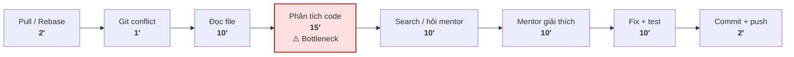
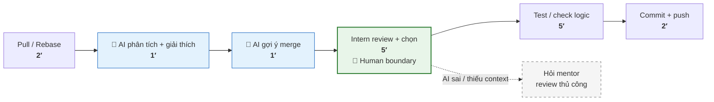
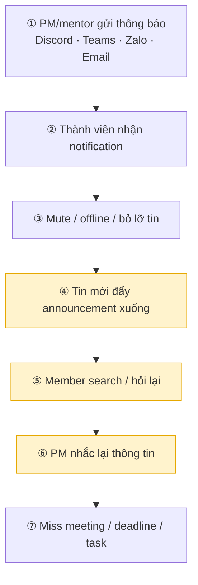
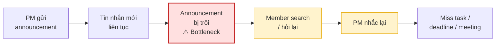
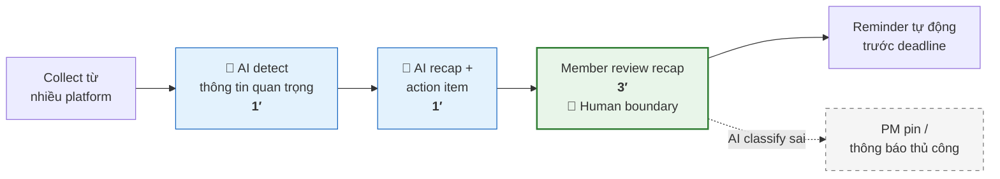
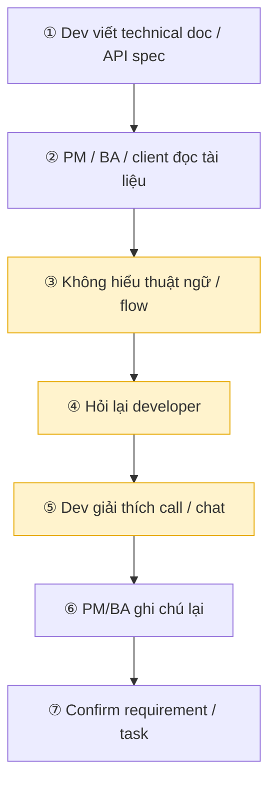
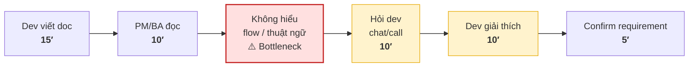
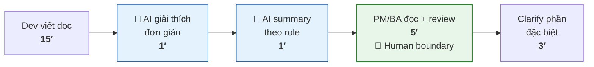

# 01 — Individual Problem Scan

## Scan rộng

Scan 8 problems.

| # | Lăng kính | Problem quan sát được | Ai đang đau? | Dấu hiệu thật |
|---|---|---|---|---|
| 1 | Tốn thời gian | Merge conflict khó xử lý với người mới | Intern/junior dev | Sợ merge |
| 2 | Pain từ người khác | Người mới không hiểu architecture/codebase | Intern | Hỏi flow liên tục |
| 3 | Communication | Team dùng nhiều group chat nên thông báo bị trôi | Cả team | Miss deadline/cuộc họp |
| 4 | Tốn thời gian | Đọc log để tìm nguyên nhân lỗi rất cực | Backend dev | Scroll log nhiều phút |
| 5 | Tốn thời gian | Setup môi trường project lỗi dependency liên tục | Intern/new dev | "Máy em không chạy" |
| 6 | AI có thể tốt hơn | Review pull request mất nhiều thời gian vì phải đọc logic thủ công | Mentor, senior dev | PR nhỏ nhưng review 20-30 phút |
| 7 | Lặp lại | Viết email/report cập nhật tiến độ cho mentor | Intern | Nội dung lặp |
| 8 | Communication | Người không technical khó hiểu tài liệu kỹ thuật | PM, BA, client | Phải nhờ dev giải thích |

## Top 3

| Rank | Problem | Vì sao chọn | Điều còn chưa chắc |
|---|---|---|---|
| 1 | Tốn thời gian — Merge conflict khó xử lý với người mới | Intern/junior dev | Sợ merge |
| 2 | Communication — Team dùng nhiều group chat nên thông báo bị trôi | Cả team | Miss deadline/cuộc họp |
| 3 | Communication — Người không technical khó hiểu tài liệu kỹ thuật | PM, BA, client | Phải nhờ dev giải thích |

### Chú thích workflow

| Ký hiệu / màu | Ý nghĩa |
|---|---|
| 🔴 Đỏ nhạt | Bottleneck chính |
| 🟡 Vàng nhạt | Bước liên quan bottleneck |
| 🔵 Xanh dương | Bước AI hỗ trợ |
| 🟢 Xanh lá | Human boundary — người quyết định cuối |
| ╌╌ Nét đứt | Fallback khi AI/rule sai |

---

## Problem Card #1 — Merge Conflict khó xử lý với người mới

**Problem 1 câu:**
Intern/junior dev thường mất nhiều thời gian và thiếu tự tin khi xử lý merge conflict, dẫn đến phải nhờ mentor hỗ trợ hoặc trì hoãn merge code.

**Actor:**
Intern/junior developer làm việc trên project Git theo team workflow có nhiều branch và commit song song.

**Thời điểm / bối cảnh:**
Khi pull code mới, rebase branch hoặc merge pull request sau khi nhiều người cùng sửa chung file/module.

**Current workflow:**

```text
1. Intern pull/rebase branch mới nhất
2. Git báo merge conflict
3. Intern mở file conflict
4. Cố đọc ký hiệu conflict markers
5. So sánh local code và incoming code
6. Không chắc nên giữ phần nào
7. Search Google/ChatGPT hoặc hỏi mentor
8. Mentor giải thích context business/code logic
9. Intern sửa conflict
10. Chạy lại project/test
11. Commit + push lại branch
```

**Bottleneck:**
Bước 5-8 — người mới thường không hiểu context của 2 đoạn code đang conflict, sợ làm hỏng logic nên phải mất nhiều thời gian tự đọc hoặc nhờ mentor hỗ trợ.

**Impact:**
Một merge conflict có thể làm intern mất từ 20-60 phút, đặc biệt với file lớn hoặc conflict nhiều chỗ. Mentor cũng bị interrupt để giải thích context hoặc review lại phần merge. Nếu xử lý sai có thể gây bug hoặc mất code của người khác.

**Success metric:**

* Giảm thời gian xử lý merge conflict trung bình từ khoảng 30-45 phút xuống dưới 10-15 phút.
* Giảm số lần phải nhờ mentor hỗ trợ.
* Không tăng số bug/revert sau merge.

**Non-AI alternative:**
Training Git workflow, guideline xử lý merge conflict, pairing với mentor hoặc dùng Git GUI tool có thể giúp giảm lỗi cơ bản, nhưng vẫn khó với conflict cần hiểu context logic/codebase.

**AI hypothesis:**
AI có thể giải thích khác biệt giữa 2 đoạn code, tóm tắt intent của từng thay đổi và gợi ý cách merge an toàn hơn. Con người vẫn phải review và quyết định final merge trước khi push.

**Quick gut:**
Workflow hoặc AI-assisted workflow, chưa chắc cần full Agent.

### Draft current workflow

**CURRENT STATE — 35–60 phút**



### Draft future workflow

**FUTURE STATE — 10–18 phút**



## Problem Card #2 — Thông báo bị trôi vì team dùng nhiều group chat

**Problem 1 câu:**
Team sử dụng nhiều nền tảng chat khác nhau như Discord, Teams, Zalo, Messenger và Email khiến thông báo quan trọng dễ bị trôi hoặc bị bỏ sót.

**Actor:**
Developer, intern, PM và các thành viên trong team cần theo dõi task, meeting và announcement hằng ngày.

**Thời điểm / bối cảnh:**
Trong quá trình làm việc hằng ngày khi task, deadline hoặc thông báo được gửi qua nhiều group chat khác nhau.

**Current workflow:**



**Bottleneck:**
Bước 4-6 — thông tin bị phân tán và trôi quá nhanh trong chat, đặc biệt khi có nhiều cuộc thảo luận song song.

**Impact:**
Team mất thời gian hỏi lại thông tin, PM phải nhắc nhiều lần và đôi khi có thành viên bỏ lỡ deadline hoặc meeting. Người mới càng khó theo kịp context làm việc của team.

**Success metric:**

* Giảm số lần hỏi lại thông tin đã được thông báo.
* Giảm số lần miss meeting/deadline.
* Giảm thời gian tìm announcement hoặc link cũ.

**Non-AI alternative:**
Quy định dùng một platform chính, pin message hoặc tạo checklist announcement có thể giúp phần nào, nhưng vẫn phụ thuộc vào việc mọi người chủ động đọc và theo dõi.

**AI hypothesis:**
AI có thể tổng hợp announcement từ nhiều nguồn, detect thông tin quan trọng và gửi recap/action item cá nhân hóa cho từng thành viên.

**Quick gut:**
Workflow, có thể kết hợp automation + AI summary/retrieval.

### Draft current workflow

**CURRENT STATE — Thông tin phân tán**



### Draft future workflow

**FUTURE STATE — Recap tập trung**



## Problem Card #3 — Người không technical khó hiểu tài liệu kỹ thuật

**Problem 1 câu:**
PM, BA hoặc client thường khó hiểu tài liệu kỹ thuật hoặc API document, dẫn đến phải nhờ developer giải thích lại nhiều lần.

**Actor:**
PM, BA, client và developer trong quá trình trao đổi requirement hoặc review tính năng kỹ thuật.

**Thời điểm / bối cảnh:**
Khi đọc API docs, technical spec, architecture document hoặc bug explanation từ phía developer.

**Current workflow:**



**Bottleneck:**
Bước 3-5 — khoảng cách technical knowledge khiến việc communication chậm và dễ hiểu sai requirement hoặc impact kỹ thuật.

**Impact:**
Developer mất thời gian giải thích lặp lại, PM/BA khó estimate hoặc trao đổi với client. Requirement dễ bị hiểu lệch giữa business và technical side.

**Success metric:**

* Giảm số lần phải clarify technical document.
* Giảm thời gian onboarding hoặc đọc spec.
* Không tăng số requirement bị hiểu sai.

**Non-AI alternative:**
Viết tài liệu đơn giản hơn, thêm glossary hoặc training nội bộ có thể hỗ trợ, nhưng vẫn phụ thuộc nhiều vào khả năng viết của developer.

**AI hypothesis:**
AI có thể chuyển technical content sang ngôn ngữ dễ hiểu hơn cho non-technical user, đồng thời tạo summary theo từng role như PM, BA hoặc client.

**Quick gut:**
Workflow hỗ trợ communication giữa technical và non-technical side.

### Draft current workflow

**CURRENT STATE — 20–40 phút clarify/spec**



### Draft future workflow

**FUTURE STATE — 8–15 phút**


