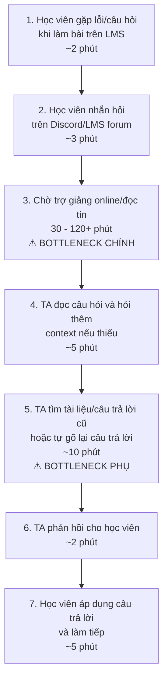
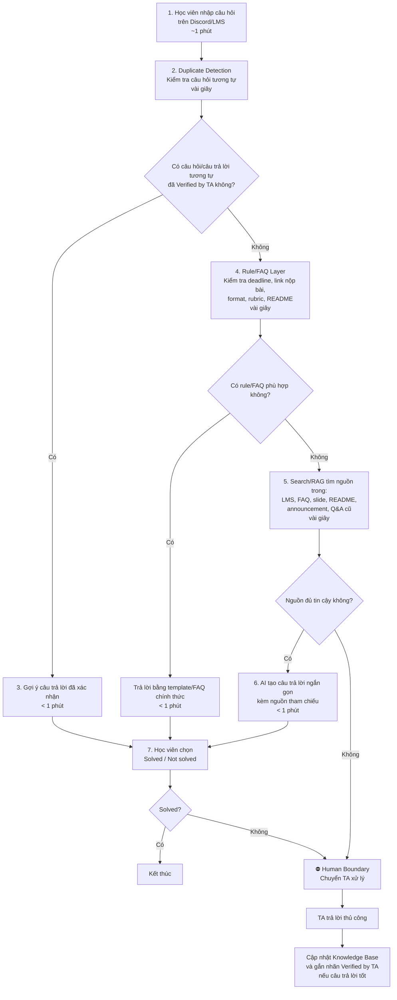

# 02 — Group Problem Statement

## Trình bày top 3 (12 candidates)


| #   | Người đưa ra | Candidate problem                                                                    | Người gặp vấn đề                                 | Điểm nghẽn                                                             | Cảm nhận nhanh                                         |
| --- | ------------ | ------------------------------------------------------------------------------------ | ------------------------------------------------ | ---------------------------------------------------------------------- | ------------------------------------------------------ |
| 1   | Nghĩa        | Debug code mất thời gian vì gom context thủ công (error log, file liên quan, search) | Sinh viên năm cuối làm bài tập / project / đồ án | Bước 3–5: gom context và xác định nguyên nhân lỗi (20–60 phút/bug)     | Workflow; pain rõ, metric thời gian tốt                |
| 2   | Nghĩa        | Nhóm project hay hỏi lại task, deadline, trạng thái                                  | Nhóm sinh viên làm đồ án / project môn học       | Bước 4–5: tìm lại quyết định và trạng thái trong chat (10–20 phút/lần) | Rule hoặc Workflow; có thể giải bằng bảng task kỷ luật |
| 3   | Nghĩa        | Khó tìm lại code/solution cũ cho bài tương tự                                        | Sinh viên học nhiều môn, nhiều repo/folder       | Bước 2–4: tìm đúng đoạn code và hiểu lại context (15–40 phút)          | Workflow; nên tổ chức repo trước, AI search là bổ trợ  |
| 4   | Hưng         | Không biết bài nộp thiếu field nào (actor, workflow, metric, boundary…)              | Học viên / nhóm trưởng trước deadline            | Bước 3: tự kiểm bằng mắt, checklist rải rác                            | Workflow; sát rubric lab, dễ pilot                     |
| 5   | Hưng         | Tìm lại quyết định/câu trả lời cũ trong nhiều kênh (Zalo, Discord, Drive, LMS)       | Học viên, nhóm trưởng, thành viên vào nhóm muộn  | Tìm keyword không hiểu ngữ cảnh; thông tin phân tán                    | Workflow; cần decision log + search có nguồn           |
| 6   | Hưng         | Tổng hợp bản cuối bài nhóm bị hỗn loạn (format, trùng/thiếu ý)                       | Người tổng hợp / nhóm trưởng                     | Bước 4–5: chuẩn hóa format và kiểm tra trùng/thiếu (1–3 giờ)           | Workflow; template + AI QC, không cần Agent            |
| 7   | Hoàng        | Tự động kiểm tra định dạng nộp bài (~500 HV, TA mất 10–15 giờ/đợt)                   | Trợ giảng / quản lý lớp                          | Bước 2: soi từng folder thủ công, dễ sót                               | Rule đủ; impact lớn, scope lớp học                     |
| 8   | Hoàng        | Gom nhặt và viết Weekly Update từ log chat nhóm                                      | Trưởng nhóm (~50–100 nhóm trong lớp lớn)         | Bước 2: lọc tin nhiễu; bước 3 & 5: tổng hợp + biên tập (45–60 phút)    | Workflow; metric rõ, phù hợp AI summary                |
| 9   | Hoàng        | Trợ giảng quá tải câu hỏi lặp lại trên Discord                                       | Học viên (hỏi) & trợ giảng (trả lời)             | Chờ đợi >2 giờ; TA tìm/gõ lại đáp án lặp                               | Workflow; FAQ/KB + bot, TA chỉ xử lý case khó          |
| 10  | Huy          | Merge conflict khó xử lý với người mới                                               | Intern / junior dev (Git nhiều branch)           | Bước 5–8: không hiểu context 2 nhánh code, nhờ mentor (35–60 phút)     | Workflow / AI-assisted; human review bắt buộc          |
| 11  | Huy          | Thông báo bị trôi vì team dùng nhiều group chat                                      | Dev, intern, PM trong team                       | Bước 4–6: announcement trôi, member hỏi lại, miss deadline             | Workflow; recap đa kênh + reminder                     |
| 12  | Huy          | Người không technical khó hiểu tài liệu kỹ thuật                                     | PM, BA, client & developer                       | Bước 3–5: không hiểu thuật ngữ/flow, hỏi dev lặp lại (20–40 phút)      | Workflow; AI giải thích theo role, dev vẫn review      |


## Gom trùng / cluster


| Cluster                                    | Candidates included                                                                                | Pattern chung                                                                                 | Ghi chú                                                                                   |
| ------------------------------------------ | -------------------------------------------------------------------------------------------------- | --------------------------------------------------------------------------------------------- | ----------------------------------------------------------------------------------------- |
| **A — Gom & tổng hợp thông tin phân tán**  | #2 (task/deadline nhóm), #6 (bản cuối bài nhóm), #8 (Weekly Update), #11 (announcement multi-chat) | Thông tin nằm rải trong chat/file; cần gom, chuẩn hóa hoặc recap cho người khác đọc/hành động | Cluster lớn nhất (4 bài); #8 và #2 gần nhau nhất — đều là “rà chat → tổng hợp trạng thái” |
| **B — Tìm kiếm / hỏi đáp / retrieval**     | #3 (code/solution cũ), #5 (quyết định/câu trả lời cũ), #9 (câu hỏi lặp TA–Discord)                 | Đã có thông tin hoặc đáp án nhưng khó tìm lại đúng chỗ, đúng ngữ cảnh                         | #9 scale lớp (~500 HV); #3–#5 scale nhóm/cá nhân                                          |
| **C — Review, kiểm tra & làm rõ nội dung** | #4 (thiếu field khi nộp), #7 (kiểm tra định dạng nộp bài), #12 (tài liệu kỹ thuật khó hiểu)        | Kiểm tra hoặc chuyển nội dung sang dạng người nhận hiểu được trước khi nộp/confirm            | #7 thiên Rule; #4 và #12 thiên Workflow + human review                                    |
| **D — Dev workflow kỹ thuật (hands-on)**   | #1 (debug gom context), #10 (merge conflict)                                                       | Nghẽn khi làm việc trực tiếp với code/Git; cần hiểu context kỹ thuật trước khi sửa            | Cả hai đều có metric thời gian rõ; #10 nhóm có thể hiểu domain thực tập                   |


## Shortlist

Mỗi cluster cử ra 1 candidate đại diện mạnh nhất để đưa vào vòng score:


| Candidate                                                                                                         | Cluster đại diện                   | Vì sao vào shortlist                                                                                                              | Rủi ro / điều chưa rõ                                                 |
| ----------------------------------------------------------------------------------------------------------------- | ---------------------------------- | --------------------------------------------------------------------------------------------------------------------------------- | --------------------------------------------------------------------- |
| **Gom nhặt và viết Weekly Update từ log chat nhóm** (#8 — Gom chat viết update)                                   | A — Gom & tổng hợp                 | Metric thời gian rõ (45–60 phút/lần); workflow rõ; phù hợp AI summary                                                             | Chất lượng output phụ thuộc vào nội dung chat; khó đo "đủ tốt"        |
| **Trợ giảng quá tải câu hỏi lặp lại trên Discord** (#9 — TA quá tải Discord)                                      | B — Tìm kiếm / hỏi đáp / retrieval | Scale lớn (~500 HV); pain có evidence (chờ >2 giờ, TA gõ lại); workflow rõ; so sánh Rule/Workflow/Agent dễ; nhóm hiểu domain thật | Cần TA đồng ý pilot; chất lượng KB/FAQ ảnh hưởng độ chính xác bot     |
| **Tự động kiểm tra định dạng nộp bài (~500 HV, TA mất ** (#7 — TA check folder)                                   | C — Review, kiểm tra & làm rõ      | Impact lớn (~500 HV, 10–15 giờ/đợt); Rule đủ để giải; scope rõ                                                                    | Thiên về Rule, ít room cho AI; ít thú vị để so sánh Workflow/Agent    |
| **Debug code mất thời gian vì gom context thủ công (error log, file liên quan, search)** (#1 — Debug mất context) | D — Dev workflow kỹ thuật          | Metric thời gian rõ (20–60 phút/bug); pain thật với sinh viên/intern                                                              | Cần codebase thật để pilot; domain khó hơn cho người không code nhiều |


## Score để đồng thuận

Chấm 1–5. Mục tiêu là ép nhóm nói rõ lý do, không chỉ vote.


| Candidate                                                 | Actor rõ | Workflow rõ | Pain có evidence | Impact đo được | Làm trong lab | So sánh R/W/A được | Nhóm hiểu domain | Tổng   |
| --------------------------------------------------------- | -------- | ----------- | ---------------- | -------------- | ------------- | ------------------ | ---------------- | ------ |
| **Trợ giảng quá tải câu hỏi lặp lại trên Discord** (#9)   | 5        | 5           | 5                | 5              | 4             | 5                  | 5                | **34** |
| **Gom nhặt và viết Weekly Update từ log chat nhóm** (#8)  | 4        | 4           | 4                | 4              | 4             | 4                  | 4                | **28** |
| **Debug code mất thời gian vì gom context thủ công** (#1) | 4        | 4           | 4                | 4              | 3             | 4                  | 3                | **26** |
| **Tự động kiểm tra định dạng nộp bài** (#7)               | 5        | 5           | 4                | 4              | 4             | 2                  | 5                | **29** |


Candidate nhóm chọn:

```
Trợ giảng quá tải câu hỏi lặp lại trên Discord — #9
```

Vì sao chọn:

```
- Actor kép rõ ràng: học viên (hỏi) và TA (trả lời/quá tải).
- Workflow hiện tại có thể vẽ được từng bước (hỏi → chờ → TA tìm → TA gõ → trả lời).
- Pain có evidence thật: chờ >2 giờ/câu hỏi, TA gõ lại cùng đáp án nhiều lần, scale ~500 HV.
- Impact đo được: thời gian chờ trung bình, số câu TA phải xử lý thủ công/ngày.
- Nhóm đang là học viên → hiểu context Discord lab thật, không phải giả định.
- So sánh Rule/Workflow/Agent rõ: có thể thử FAQ tĩnh (Rule) trước khi leo lên bot có retrieval (Workflow).
```

Vì sao không chọn các candidate còn lại:

```
- Kiểm tra định dạng (#7): score cao nhưng thiên Rule thuần — ít room để so sánh Workflow/Agent,
  không đủ thú vị để deep-dive trong lab.
- Weekly Update (#8): pain thật nhưng bottleneck nằm ở chất lượng tổng hợp, 
  khó đo "đủ tốt" và overlap với nhiều tool summary có sẵn.
- Debug gom context (#1): domain kỹ thuật sâu, pilot cần codebase thật, 
  không phải toàn nhóm đủ hiểu domain để challenge và validate.
```

Nếu có disagreement, nhóm xử lý thế nào:

```
Nhóm đồng thuận. TA Bot Discord dẫn điểm rõ (34) và có evidence thật ngay trong bối cảnh lab hôm nay.
Điểm khác biệt chính: đây là bài toán nhóm đang trực tiếp trải nghiệm,
không cần giả định thêm về actor hay workflow.
```

---

## Quick Validation

Nhóm chọn **Option A — Quick interviews** kết hợp quan sát trực tiếp trong lớp.

### Câu hỏi hỏi TA và học viên

- Lần gần nhất bạn gặp câu hỏi lặp lại trên Discord là khi nào?
- Bạn mất khoảng bao lâu để tìm lại đáp án cũ và gõ lại?
- Học viên thường chờ bao lâu mới có phản hồi?
- Bước nào mất thời gian hoặc bực bội nhất?
- Nếu có bot trả lời câu hỏi FAQ tự động, bạn lo ngại điều gì nhất?

### Kết quả validation


| Nguồn                        | Số người / mẫu    | Tín hiệu xác nhận                                                                                                                       | Tín hiệu phản bác                                                            | Nhóm sửa problem thế nào                                                                                                 |
| ---------------------------- | ----------------- | --------------------------------------------------------------------------------------------------------------------------------------- | ---------------------------------------------------------------------------- | ------------------------------------------------------------------------------------------------------------------------ |
| Quick interview (TA)         | 2                 | Cả 2 TA xác nhận phải trả lời cùng câu hỏi về setup môi trường, nộp bài, lỗi cài đặt nhiều lần; mỗi câu mất 3–8 phút tìm + gõ lại       | 1 TA lo bot trả lời sai gây học viên hiểu nhầm                               | Thu hẹp scope: bot chỉ trả lời câu hỏi có đáp án rõ ràng (FAQ, hướng dẫn nộp bài, lỗi phổ biến); câu mơ hồ vẫn chuyển TA |
| Quan sát Discord thực tế     | ~30 tin nhắn/ngày | Khoảng 60–70% câu hỏi lặp lại cùng chủ đề (setup, deadline, lỗi cài đặt); thời gian chờ phản hồi trung bình >2 giờ ngoài giờ hành chính | Một số câu hỏi cần context cá nhân (TA phải hỏi ngược lại trước khi trả lời) | Giữ TA trong loop cho câu hỏi cần context; bot chỉ auto-reply câu hỏi match FAQ ≥ ngưỡng similarity                      |
| Mini poll học viên trong lớp | 8                 | 6/8 từng phải chờ >1 giờ và tự tìm lại trong thread cũ; 5/8 nói sẽ thử hỏi bot nếu có                                                   | 2/8 lo bot trả lời không đúng version tài liệu hiện tại                      | Thêm metadata version/ngày cho mỗi entry trong KB để bot ưu tiên thông tin mới nhất                                      |


### Insight sau validation

```
Pain thật không nằm ở việc "TA không muốn trả lời". 
Pain nằm ở chỗ câu hỏi lặp lại chiếm phần lớn thời gian TA và làm học viên mất
thời gian chờ đợi không cần thiết — trong khi đáp án đã tồn tại ở đâu đó trong thread cũ hoặc tài liệu.
Bottleneck thật: retrieval đúng câu hỏi + đúng ngữ cảnh, không phải thiếu đáp án.
```

---

## Research giải pháp

Nhóm không giả định ngay phải xây Agent toàn năng. Sau khi rà soát các giải pháp hiện có, nhóm gom thành các nhóm pattern chính: phát hiện câu hỏi trùng, trả lời theo Rule/FAQ, tìm kiếm bằng Search/RAG, hỗ trợ tương tác trên Discord, và chuyển tiếp cho TA khi bot không chắc.


| Nguồn / tool / case                        | Link                                                          | Họ giải quyết phần nào?                                                                          | Điểm mạnh                                                                                    | Khoảng trống / rủi ro                                                                                 | Bài học cho nhóm                                                                                             |
| ------------------------------------------ | ------------------------------------------------------------- | ------------------------------------------------------------------------------------------------ | -------------------------------------------------------------------------------------------- | ----------------------------------------------------------------------------------------------------- | ------------------------------------------------------------------------------------------------------------ |
| Piazza — Duplicate Post & Endorsement      | [piazza.com](https://piazza.com)                              | Gợi ý bài đăng tương tự trước khi học viên hỏi; instructor endorsement xác nhận câu trả lời đúng | Giảm câu hỏi trùng ngay từ đầu; tạo lớp tri thức đáng tin với nhãn xác nhận                  | Chỉ là diễn đàn Q&A; không tích hợp Discord/LMS; câu hỏi diễn đạt khác nhau có thể không detect trùng | Thêm duplicate detection trước khi đăng; gắn nhãn "Verified by TA" cho câu trả lời đã được xác nhận          |
| Disdoc — AI Teaching Assistant for CS      | [SIGCSE 2024](https://dl.acm.org/doi/10.1145/3626252.3630798) | AI TA hỗ trợ học viên trong lớp học công nghệ quy mô lớn                                         | Định vị AI là Teaching Assistant, không chỉ là chatbot                                       | Rủi ro trả lời sai, quá mức; học viên phụ thuộc bot thay vì tự học                                    | Bot nên có giới hạn rõ: trả lời phổ biến, gợi ý hướng giải, trích nguồn, chuyển case khó cho TA              |
| DiscordBot for Interactive Learning        | [arXiv:2304.14449](https://arxiv.org/abs/2304.14449)          | Bot hỗ trợ quiz, điểm danh, thu thập phản hồi liên tục qua Discord                               | Chứng minh Discord là kênh hợp lý cho giáo dục; bot có thể thu thập analytics học tập        | Không trực tiếp giải bài toán câu hỏi lặp lại                                                         | Nếu triển khai trên Discord, cần ghi log, thống kê chủ đề bị hỏi nhiều để TA biết điểm nghẽn                 |
| Dify — Customer Service Bot with RAG       | [dify.ai](https://dify.ai)                                    | Biến tài liệu chính thức thành Knowledge Base; dùng RAG để tìm và trả lời                        | Bot ít bịa hơn chatbot LLM thuần vì câu trả lời dựa trên tài liệu                            | Nếu KB lỗi thời hoặc tài liệu nguồn sai, bot vẫn trả lời sai                                          | Xây Course Knowledge Base riêng; mỗi câu trả lời bắt buộc kèm nguồn; không có nguồn → chuyển TA              |
| BetaHub — AI Discord Bot for Docs          | [betahub.io](https://betahub.io)                              | Trả lời tự động trong Discord từ tài liệu upload; không biết thì im lặng                         | Rất sát Discord; pattern "không biết thì im" phù hợp môi trường giáo dục                     | Thiên về documentation/community; chưa xử lý rubric, điểm số, bài nộp cá nhân                         | Bot phải có phạm vi rõ; không xử lý dữ liệu cá nhân; case nhạy cảm chuyển TA                                 |
| Jill Watson — Georgia Tech AI TA           | [cc.gatech.edu](https://www.cc.gatech.edu/news/jill-watson)   | Trả lời câu hỏi lặp lại về logistics, policy, syllabus trong lớp học quy mô lớn                  | Chứng minh AI TA hiệu quả trong lớp đông; giải phóng TA tập trung vào case khó               | Cần thời gian xây KB ban đầu; không xử lý câu hỏi kỹ thuật mới hoặc cá nhân hóa                       | AI xử lý câu hỏi phổ biến có nguồn rõ; TA xử lý escalation — phù hợp lớp ~500 HV                             |
| Mava — Discord Community Support Bot       | [mava.app](https://mava.app)                                  | Trả lời tự động câu hỏi lặp lại; ticketing để chuyển human agent khi bot không trả lời được      | Tích hợp thẳng Discord; cơ chế fallback sang người thật rất tốt                              | Thiết kế cho cộng đồng thương mại; cần bổ sung kiểm soát sư phạm khi dùng trong giáo dục              | Workflow nên có cấu trúc: bot phản hồi ngay nếu chắc, không chắc thì escalate TA                             |
| Chat Thing — AI Knowledge Base Bot         | [chatthing.ai](https://chatthing.ai)                          | Tạo bot Discord trả lời từ PDF, Notion, website; chỉ trả lời khi có nguồn trong KB               | Dễ triển khai; phù hợp để đưa slide, worksheet, FAQ, rubric vào hệ thống                     | Chưa đủ để hiểu lỗi kỹ thuật cá nhân như lỗi code riêng, repo riêng, bài nộp cụ thể                   | Trước khi làm AI, phải làm tốt bước non-AI: tổng hợp FAQ, tài liệu, câu trả lời cũ. AI chỉ tốt khi KB đủ tốt |
| Discord Static FAQ Bot (Carl-bot, FAQ Pro) | [carl.gg](https://carl.gg)                                    | Trả lời tức thì khi học viên gõ trigger cố định như !deadline, !format, !link                    | Nhanh, rẻ, ổn định, không hallucination; phù hợp câu hỏi logistics lặp lại có đáp án cố định | Học viên phải biết đúng keyword; không hiểu câu hỏi tự nhiên; không xử lý được ngoài danh sách rule   | Rule bot nên dùng ở lớp đầu tiên cho câu hỏi cố định, nhưng không thể là toàn bộ giải pháp                   |


Research takeaway:

```
Không nên xây Agent phức tạp ngay từ đầu. Pattern phù hợp nhất là Workflow nhiều lớp:

  Duplicate Detection
  → Verified FAQ / Rule Bot
  → Search/RAG-based AI Teaching Assistant
  → Human Escalation
  → Update Knowledge Base

Mỗi lớp xử lý một nhóm câu hỏi cụ thể, có fallback rõ ràng.
Nhóm chọn Workflow, không chọn Agent ở giai đoạn MVP.
```

---

## Workflow before/after







*(Biểu đồ flowchart sẽ bổ sung sau.)*

Bottleneck mới:

```text
TA review các câu bị đánh dấu Not solved hoặc chuyển lên.
Đây là bottleneck chấp nhận được vì TA chỉ tập trung vào case khó,
case không chắc hoặc cần phán đoán sư phạm — không còn phải xử lý toàn bộ câu hỏi.
```

Before/after impact:


| Metric                                        | Trước                        | Sau kỳ vọng                      | Ghi chú                                                    |
| --------------------------------------------- | ---------------------------- | -------------------------------- | ---------------------------------------------------------- |
| Thời gian phản hồi câu hỏi phổ biến           | 30 phút – hơn 2 tiếng        | Dưới 2 phút                      | Target chính                                               |
| Số bước chính                                 | 7                            | 7                                | Số bước không giảm nhiều, nhưng thời gian chờ giảm mạnh    |
| Câu hỏi trùng được chặn trước khi đăng        | Gần như không có             | Có duplicate suggestion          | Lấy pattern từ Piazza                                      |
| Câu trả lời được xác nhận bởi TA              | Rời rạc trong chat           | Có nhãn Verified by TA           | Biến câu trả lời tốt thành tài sản tri thức                |
| Tỷ lệ câu hỏi phổ biến TA phải xử lý thủ công | ~100%                        | Giảm khoảng 70%                  | Chỉ tính câu hỏi có nguồn rõ                               |
| Bước TA làm thủ công                          | 4/7 bước                     | 1–2/7 bước                       | TA chỉ xử lý case khó hoặc Not solved                      |
| Thời gian công TA cho câu hỏi lặp lại         | ~51 giờ/ngày                 | ~15,3 giờ/ngày                   | Theo giả định 300 câu/ngày, 60% lặp lại, AI resolution 70% |
| Thời gian công TA tiết kiệm                   | 0                            | ~35,7 giờ/ngày                   | Hiệu quả vận hành chính                                    |
| Bottleneck chính                              | Chờ TA phản hồi              | TA review case Not solved        | Human boundary                                             |
| Risk mới                                      | Không có hallucination từ AI | Có retrieval sai / hallucination | Cần nguồn, confidence threshold và fallback                |
| Tỷ lệ câu trả lời có nguồn                    | Không ổn định                | 100% với bot answer              | Bot bắt buộc trả lời kèm nguồn                             |
| Cập nhật tri thức sau hỗ trợ                  | Không hệ thống               | Có Knowledge Base update         | Case mới được bổ sung sau khi TA xử lý                     |


---

## Problem Statement v0


| Field              | Nội dung                                                                                                                                                                     |
| ------------------ | ---------------------------------------------------------------------------------------------------------------------------------------------------------------------------- |
| **Actor**          | Học viên làm bài thực hành trên LMS và trợ giảng phụ trách hỗ trợ qua Discord/LMS forum.                                                                                     |
| **Workflow**       | Học viên gặp lỗi/câu hỏi → hỏi trên Discord/LMS → chờ TA → TA đọc câu hỏi → TA tìm lại tài liệu hoặc gõ lại câu trả lời → học viên áp dụng và làm tiếp.                      |
| **Bottleneck**     | Học viên phải chờ TA phản hồi từ 30 phút đến hơn 2 tiếng; TA phải trả lời lặp lại nhiều câu hỏi phổ biến đã từng có câu trả lời.                                             |
| **Impact**         | Học viên bị kẹt tiến độ làm bài; TA quá tải với câu hỏi lặp lại thay vì tập trung hỗ trợ case khó; lớp đông khiến câu hỏi dễ bị trôi trong chat.                             |
| **Success Metric** | Giảm thời gian phản hồi câu hỏi phổ biến xuống dưới 2 phút; giảm khoảng 70% câu hỏi phổ biến TA phải trả lời thủ công; 100% câu trả lời tự động có nguồn.                    |
| **Boundary**       | Bot không tự trả lời nếu không có nguồn; không sửa code thay học viên; không xử lý dữ liệu cá nhân như điểm số/submission nếu chưa có quyền; case không chắc phải chuyển TA. |


---

## Rule / Workflow / Agent


| Mức          | Phương án cho bài toán nhóm                                                                                                                        | Khi nào đủ                                                                                       | Rủi ro                                                                             | Chọn?                                          |
| ------------ | -------------------------------------------------------------------------------------------------------------------------------------------------- | ------------------------------------------------------------------------------------------------ | ---------------------------------------------------------------------------------- | ---------------------------------------------- |
| **Rule**     | FAQ tĩnh, template answer, keyword bot, duplicate suggestion, Verified FAQ cho deadline, link nộp bài, format, rubric, README                      | Đủ nếu phần lớn câu hỏi là hành chính, lặp lại nguyên văn và có đáp án cố định                   | Không hiểu câu hỏi diễn đạt khác; khó xử lý câu hỏi dài hoặc cần đọc hiểu tài liệu | Không chọn làm toàn bộ, nhưng dùng làm lớp đầu |
| **Workflow** | Duplicate Detection → Verified FAQ/Rule Bot → Search/RAG tìm nguồn → AI draft câu trả lời kèm nguồn → học viên feedback → chuyển TA nếu không chắc | Hợp vì workflow tuyến tính, AI chỉ hỗ trợ các bước phát hiện trùng, tìm nguồn và tạo câu trả lời | Retrieval sai, câu trả lời nhạt/sai, tài liệu cũ, cần nguồn và fallback rõ         | **Chọn**                                       |
| **Agent**    | Agent tự đọc câu hỏi, hỏi thêm context, truy cập LMS/API/repo, phân tích lỗi, trả lời và cập nhật KB                                               | Chỉ cần nếu workflow nhiều nhánh, cần tự quyết định bước tiếp theo và gọi nhiều công cụ          | Quá rộng, nhiều permission/risk, dễ truy cập nhầm dữ liệu cá nhân, khó kiểm soát   | Chưa chọn                                      |


Mức chọn:

```
Workflow.
```

Vì sao chọn Workflow:

```
- Phần lớn câu hỏi có thể xử lý theo luồng rõ ràng: kiểm tra trùng → tìm câu trả lời đã Verified
  → tìm nguồn trong KB → tạo câu trả lời kèm nguồn → chuyển TA nếu không chắc.
- Rule/FAQ đủ tốt cho các câu hỏi cố định như deadline, link nộp bài, format, rubric.
- Search/RAG cần thiết cho câu hỏi diễn đạt tự nhiên nhưng vẫn có căn cứ trong tài liệu.
- Human Escalation là lớp kiểm soát chất lượng, đảm bảo AI không tự bịa hoặc xử lý vượt phạm vi.
- Chưa cần Agent vì workflow không cần tự lập kế hoạch động hoặc gọi nhiều công cụ không xác định.
```

Vì sao không chọn mức đơn giản hơn (Rule thuần):

```
Rule bot không hiểu câu hỏi diễn đạt tự nhiên — học viên phải biết đúng keyword mới gọi được bot.
Với ~500 HV và câu hỏi đa dạng, Rule thuần chỉ xử lý được phần nhỏ và dễ bỏ sót case cần hỗ trợ.
```

---

## Problem Statement v1


| Field                            | Nội dung                                                                                                                                                                                                                                                                                                                                |
| -------------------------------- | --------------------------------------------------------------------------------------------------------------------------------------------------------------------------------------------------------------------------------------------------------------------------------------------------------------------------------------- |
| **Actor**                        | Học viên làm bài thực hành trong lớp học quy mô lớn (~500 HV) và trợ giảng hỗ trợ qua Discord/LMS forum.                                                                                                                                                                                                                                |
| **Workflow**                     | Học viên nhập câu hỏi trên Discord/LMS → hệ thống kiểm tra câu hỏi trùng → nếu có Verified answer thì gợi ý ngay → nếu không thì Rule/FAQ kiểm tra câu hỏi cố định → nếu vẫn chưa xử lý được thì Search/RAG tìm nguồn trong FAQ/LMS/README/Q&A cũ → AI trả lời kèm nguồn → học viên chọn Solved/Not solved → case không chắc chuyển TA. |
| **Bottleneck**                   | Câu hỏi phổ biến bị xử lý thủ công nhiều lần; học viên chờ 30 phút đến hơn 2 tiếng; TA mất thời gian lặp lại câu trả lời thay vì xử lý case khó.                                                                                                                                                                                        |
| **Impact**                       | Học viên chậm tiến độ; TA quá tải; câu hỏi trong lớp đông dễ bị trôi; tri thức đã được trả lời trước đó không được tái sử dụng hiệu quả.                                                                                                                                                                                                |
| **Success Metric**               | Giảm thời gian phản hồi câu hỏi phổ biến xuống dưới 2 phút; giảm ~70% câu hỏi TA phải trả lời thủ công; 100% câu trả lời của bot có nguồn tham chiếu; theo dõi tỷ lệ Solved/Not solved.                                                                                                                                                 |
| **Boundary**                     | AI không tự trả lời nếu không tìm thấy nguồn; không bịa thông tin; không sửa code thay học viên; không truy cập điểm số/submission/repo cá nhân nếu chưa được cấp quyền; case không chắc chuyển TA.                                                                                                                                     |
| **AI intervention point**        | Trước khi học viên đăng câu hỏi: AI kiểm tra duplicate. Sau khi học viên hỏi: AI tìm nguồn và draft câu trả lời kèm nguồn trước khi TA phải can thiệp thủ công.                                                                                                                                                                         |
| **Mức chọn**                     | Workflow: Duplicate Detection + Verified FAQ/Rule Bot + Search/RAG + AI answer with source + Human Escalation.                                                                                                                                                                                                                          |
| **Rủi ro & người thật kiểm tra** | Risk: hallucination, lấy nhầm nguồn, trả lời quá chung, tài liệu cũ, học viên phụ thuộc bot. Người thật kiểm tra: TA review các câu bị đánh dấu Not solved, cập nhật KB và gắn nhãn Verified by TA cho câu trả lời quan trọng.                                                                                                          |


---

## Final decision

Decision:

```
Go với scope nhỏ.
```

Nhóm không triển khai Agent toàn năng ngay từ đầu. Thay vào đó, nhóm chọn MVP theo hướng Workflow có kiểm soát:

```
Duplicate Detection
+ Verified FAQ / Rule Bot
+ Search/RAG-based AI Teaching Assistant
+ Human Escalation
+ Knowledge Base Update
```

Pilot nhỏ nhất:

```
1. Thu thập 20–30 câu hỏi phổ biến nhất trong 2 tuần gần nhất.
2. Gom tài liệu thành Course Knowledge Base:
   - LMS guide, README, Assignment instructions, Rubric, Announcement, FAQ, câu trả lời cũ của TA.
3. Gắn nhãn "Verified by TA" cho một số câu trả lời đã được trợ giảng xác nhận.
4. Chạy thử duplicate detection: học viên nhập câu hỏi → hệ thống gợi ý câu hỏi/câu trả lời tương tự nếu có.
5. Nếu không có câu trả lời tương tự, chạy Rule/FAQ (deadline, link nộp bài, format, rubric, README).
6. Nếu vẫn chưa xử lý được, chạy Search/RAG: tìm nguồn trong KB → AI tạo câu trả lời kèm nguồn → TA review trong giai đoạn pilot.
7. Đo 5 chỉ số:
   - Thời gian phản hồi trung bình.
   - Tỷ lệ câu hỏi được giải quyết mà không cần TA.
   - Tỷ lệ câu hỏi phải chuyển TA.
   - Tỷ lệ học viên chọn Solved/Not solved.
   - Tỷ lệ câu trả lời bị TA sửa lại.
```

Exit / rollback:

```
- Nếu duplicate detection gợi ý sai quá nhiều → chỉ giữ Verified FAQ cho câu hỏi rõ ràng.
- Nếu AI trả lời sai hoặc không có nguồn quá 30% case → hạ xuống FAQ + rule bot.
- Nếu học viên vẫn hỏi TA vì không tin bot → thêm nhãn "TA verified answer" cho câu trả lời đã duyệt.
- Nếu nhiều câu hỏi cần xem code/repo cá nhân → thu hẹp scope về câu hỏi hành chính, setup, nộp bài và lỗi phổ biến trước.
- Nếu TA phải sửa lại hơn 70% câu trả lời trong 2 tuần liên tiếp → dừng RAG answer và chỉ dùng Search + FAQ.
```

Decision rationale:

```
Problem rõ, workflow rõ, metric rõ. Không có một công cụ đơn lẻ nào giải quyết toàn bộ bài toán.
Piazza mạnh ở duplicate detection và endorsement; Dify/Chat Thing/BetaHub mạnh ở KB/RAG;
Mava mạnh ở Discord và escalation; Jill Watson chứng minh AI TA hiệu quả trong lớp đông;
Discord Static FAQ Bot phù hợp cho câu hỏi cố định; DiscordBot gợi ý thêm khả năng analytics.

Phương án tốt nhất là kết hợp các pattern này thành Workflow nhỏ, có kiểm soát.
AI chỉ tham gia vào các bước cụ thể: phát hiện câu hỏi trùng, tìm nguồn, tạo câu trả lời kèm nguồn
và chuyển câu khó cho TA. Human boundary rõ ràng giúp giảm rủi ro hallucination,
bảo vệ chất lượng hỗ trợ và giữ vai trò kiểm soát của con người.

Đây là hướng triển khai phù hợp nhất cho MVP: giảm tải TA, cải thiện tốc độ phản hồi,
và đo lường hiệu quả bằng các chỉ số cụ thể.
```

